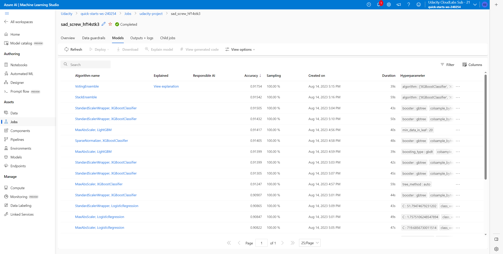

# Optimizing an ML Pipeline in Azure

## Overview
This project is part of the Udacity Azure ML Nanodegree.
In this project, we build and optimize an Azure ML pipeline using the Python SDK and a provided Scikit-learn model.
This model is then compared to an Azure AutoML run.

## Summary

This dataset contains a marketing campaign of a financial institution to improve future marketing campaigns for the bank. In this project, we aim to predict if a customer will sign the bank deposit (target variable `y`) using various features such as `marital`, `housing`, `job`, and `education`. The dataset consists of 32950 entries and 21 columns. Our objective is to build predictive models that can accurately forecast target variables based on the provided data.

The best-performing model was the **Voting Ensemble** algorithm which demonstrated 91.754% accuracy. It outperformed the Logistics Regression model with 90.993% accuracy which is fine-tuned by HyperDrive. Additionally, it has slightly better performance than other approaches that are explored by AutoML.

## Scikit-learn Pipeline

First, we retrieve the banking dataset using the `TabularDatasetFactory` class from Azure Machine Learning SDK.
After that, we clean and split the data to train a `LogisticRegression` classification model using the scikit-learn library.
Finally, the model is saved to use it later. The best configuration was acquired with the help of HyperDrive.

The tuned hyperparameters are the following:
- Inverse of regularization strength captured in the `--C` argument
- Maximum number of iterations as the `--max-iter` argument

The regularization parameter was selected between 0 and 10 uniformly and we choose the maximum number of iterations from the 20, 40, 60, 80, or 100 number set. The `RandomParameterSampling` algorithm randomly samples these parameters. Random sampling helps ensure **unbiased** representation of a **parameter** by minimizing selection bias.

We selected the `BanditPolicy` as the early stopping policy. It is beneficial for **resource-efficient** hyperparameter tuning by dynamically terminating poorly performing runs, saving time and computational resources.

## AutoML

The AutoML process is configured to exit an experiment after 30 minutes. It searched among classification models that optimize accuracy. The number of cross-validations was set to five. At the end of the experiments, we obtained the Voting Ensemble as the best model.

The Voting Ensemble algorithm, titled `PreFittedSoftVotingClassifier`, is composed of multiple sub-models (estimators) that collaborate to make predictions. Each sub-model is assigned a weight based on its performance. The ensemble combines the predictions from these sub-models to produce the final result. The sub-models include various classifiers such as `XGBoostClassifier`, `LightGBMClassifier`, and `SGDClassifierWrapper`. The algorithm dynamically blends these classifiers by multiplying them by weights (0.2, 0.07, 0.07, 0.33, 0.07, 0.07, 0.13, 0.07) to optimize predictive accuracy.

## Pipeline comparison

The HyperDrive focuses on tuning a single model while AutoML considers multiple model options for our classification problem. Let's compare the best models for each method:

| Method | Model | Accuracy |
|---|---|---|
| HyperDrive | Logistic Regression  | 90.993% |
| AutoML| Voting Ensemble | 91.754% |

See the [HyperDrive trials](./images/hyperdrive_trials.png) and [AutoML models](./images/automl_models.png) pictures for more information.

The HyperDrive method was faster (18 minutes) to execute than the AutoML which took around 34 minutes to finish.
For AutoML, the [features engineering](./images/automl_data_transformation.png) and [feature importance](./images/automl_explanations.png) was calculated automatically without any additional code. On the contrary, HyperDrive did not create features by itself.
We can compare the two methods as breadth-first (AutoML) and depth-first (HyperDrive) search algorithms.

## Future work

The future experiment can be set up for the HyperDrive to include more hyperparameters. Additionally, we can try out other classification models and metrics to tune with HyperDrive.
Regarding AutoML, we can run the experiment longer to find better alternatives. However, considering the trade-off between the additional cost and the benefit are important.

## Useful Resources

- [Bank Marketing Dataset](https://www.kaggle.com/datasets/janiobachmann/bank-marketing-dataset)
- [ScriptRunConfig Class](https://docs.microsoft.com/en-us/python/api/azureml-core/azureml.core.scriptrunconfig?view=azure-ml-py)
- [Configure and submit training runs](https://docs.microsoft.com/en-us/azure/machine-learning/how-to-set-up-training-targets)
- [HyperDriveConfig Class](https://docs.microsoft.com/en-us/python/api/azureml-train-core/azureml.train.hyperdrive.hyperdriveconfig?view=azure-ml-py)
- [How to tune hyperparamters](https://docs.microsoft.com/en-us/azure/machine-learning/how-to-tune-hyperparameters)
- [Automated Machine Learning](https://learn.microsoft.com/en-us/azure/machine-learning/concept-automated-ml?view=azureml-api-2)
- [Voting Ensemble](https://learn.microsoft.com/en-us/python/api/azureml-training-tabular/azureml.training.tabular.models.voting_ensemble.prefittedsoftvotingclassifier?view=azure-ml-py)