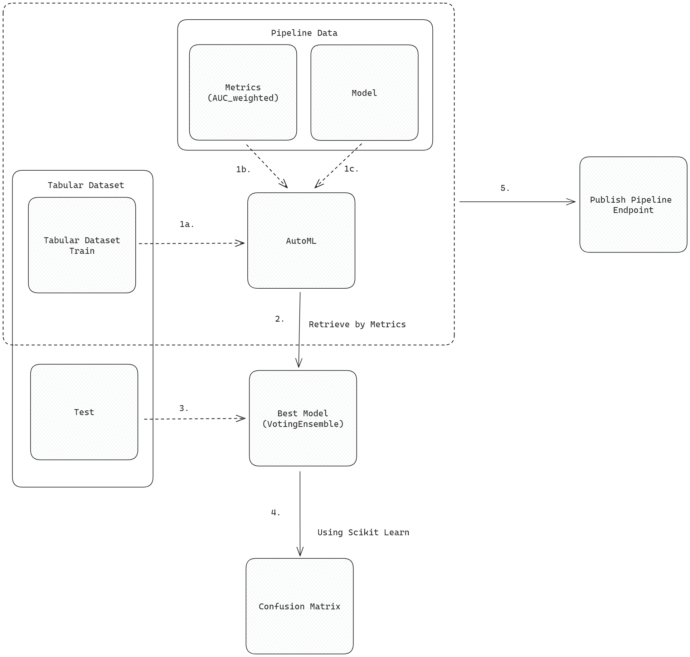

# Operationalizing Machine Learning

In this project, we will continue working with the Bank Marketing dataset. We will utilize Azure to set up a cloud-based machine learning production model, carry out its deployment, and access it as consumers. Additionally, we will construct, release, and use a pipeline.

## Architectural Diagram

## Key Steps

In the initial step, we download the training dataset by using an Azure blob storage link. Next, we perform an Automated ML Experiment. We are logging the metrics and model data during the expirement. Before publishing the endpoint, we get the testing dataset to test the best model. After retrieving the best model, we measure the performance with confusion matrix which is provided by the `scikit-learn` library. We then publish the pipeline that enables a REST endpoint to rerun the pipeline from any HTTP request. Note that, we need to authenticate first if we would like to execute the pipeline using the endpoint. 

## Screen Recording

The link to the screen recording of the project: https://youtu.be/n904NpzQUE4

> It was really funny when the Udacity Virtual Machine just died at the end of the video, at the "best" time. Lucky me! :smile:

The screenshots can be found under the `./screenshots` folder:
1. [Registered Dataset](./screenshots/registered_dataset.png)
2. [Experiment Running](./screenshots/experiment_running.png)
3. [Experiment Completed](./screenshots/experiment_completed.png)
4. [Pipeline Running](./screenshots/pipeline_running.png)
5. [Pipeline Completed](./screenshots/pipeline_completed.png)
6. [Pipeline Endpoints](./screenshots/pipeline_endpoints.png)
7. [Pipeline Endpoint Overview](./screenshots/pipeline_endpoint_overview.png)
8. [Pipline Widget](./screenshots/widget_pipeline_run.png)
9. [Published Pipeline Widget](./screenshots/widget_published_pipeline_run.png)
10. [Best Model](./screenshots/best_model.png)
11. [Application Insights Enabled](./screenshots/application_insights_enabled.png)
12. [Logs Output](./screenshots/logs_output.png)
13. [SwaggerUI Terminal](./screenshots/swagger_terminal.png)
14. [SwaggerUI Page](./screenshots/swagger_browser_port_9000.png)
15. [Endpoint Output](./screenshots/endpoint_output.png)
16. [Apache Benchmark Output](./screenshots/apache_benchmark.png)

## Tips and Tricks

- Compute cluster
  - At the second step, the compute cluster name is typod. Use the `STANDARD_D2_V2` virtual machine instead of `STANDARD_D12_V2` because you will not have permission to create it.
  - Set the minimum node to 1 and change priority from **Dedicated** to **Low Priority** which saves compute cost.
- Model deployment
  - Navigate to **Jobs** > **Model** tab > press **Deploy** button
  - Select the compute type as `Azure Container Instance` and check in the **Enable Logging** and the **Enable Applications Insights** under the advanced settings.
- Run Widget
  - If you can not see the Widget output, change the browser to Microsoft Edge.
- Python and Bash scripts
  - Execute the *Python scripts* with the **Windows Command Prompt** because it will freeze if you use Git Bash.
  - Execute the *Bash scripts* with the **Git Bash** because Windows Command Prompt was no WSL therefore the `bash` command will not work.
- Endpoint script
  - Retrieve the authentication information from the **Endpoints** > **Consume** tab.
  - Copy and assign the **REST endpoint** value to the `scoring_uri` variable.
  - Copy and assign the one of the **Authentication** key to the `key` variable.
  - Make sure that the `data` dictionary match with the example data that is provided under the **Consume** tab. Otherwise, you will got error in the response.
- Swagger UI
  - First, download the `swagger.json` under the **Endpoints** > **Details** tab > **Swagger URI** section. In the Udacity VM, both `wget` and `curl` did not work for me so create an empty `swagger.json` file and open the URI and copy the content to the JSON file.
  - You need to change the port from 80 to other port that is more than 8000 (e.g. 9000) otherwise the [Swagger UI webpage](./screenshots/swagger_browser_port_80.png) will only show "It works" text. Go to the `swagger/swagger.sh` script and change the port at the `-p` option.
  - Execute both the `serve.py` and the `swagger.sh` script before opening the SwaggerUI (<http://localhost>) webpage. Then update the explore URL to <http://localhost:8000/swagger.json> and click on the **Explore** button.
- Apache Benchmark
  - Similarly to the endpoint script, get the authentication information.
  - Replace the `REPLACE_WITH_KEY` with the `Primary Key` or with the `Secondary Key` authentication key.
  - Replace the `http://REPLACE_WITH_API_URL/score` with the **REST endpoint** URL value.